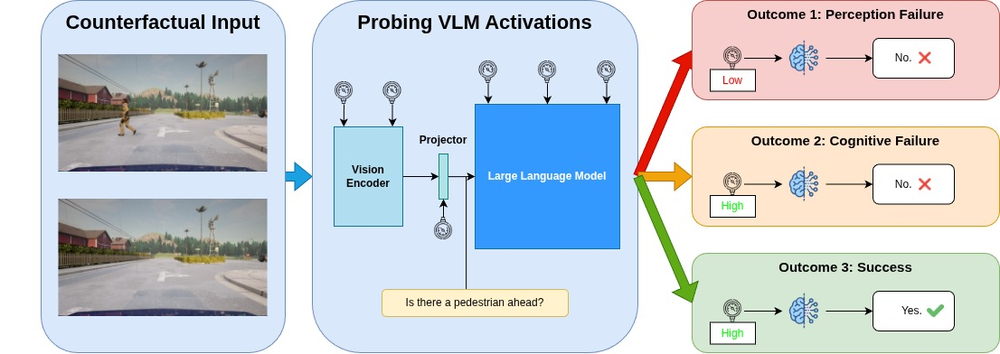

# Probing Visual Concepts in Vision-Language Models for Autonomous Driving

[](https://arxiv.org/abs/XXXX.XXXXX)
[](https://drive.google.com/PLACEHOLDER)
[](https://opensource.org/licenses/MIT)

This repository contains the implementation of our work on probing visual concepts in traffic scenes using Vision-Language Models (VLMs). We investigate how different layers of VLMs encode traffic-relevant visual concepts through linear probing.



## Overview

We analyze the internal representations of state-of-the-art small VLMs to understand how they encode various traffic scene concepts, including:

- **Presence**: Whether something is present in the scene
- **Count**: How many instances of an object are present in the scene
- **Spatial Understanding**: Where something is located
in the scene in relation to something else
- **Orientation Detection**: The orientation of an object in the scene

## Dataset

Download our counterfactual images dataset from: **[Dataset Link Placeholder](https://placeholder-dataset-link.com)**

Each annotation corresponds to an image and includes:
- `image_path`
- `distance`: Distance to the object (for distance-stratified analysis)
- `label`: Ground truth label for the visual concept
- `weather`: The weather conditions in CARLA simulator for the specific sample
- `town`: CARLA town identifier (used for train/val/test splits)

## Supported Models

- **[Ovis2.5-2B](https://huggingface.co/AIDC-AI/Ovis2.5-2B)**
- **[InternVL3.5-2B](https://huggingface.co/OpenGVLab/InternVL3_5-2B)**
- **[VST-3B](https://huggingface.co/rayruiyang/VST-3B-RL)** (SFT and RL variants)

## Installation

```bash
# Clone the repository
git clone https://github.com/niktheod/probing_visual_concepts_in_traffic_scenes.git
cd probing_visual_concepts_in_traffic_scenes

# Create and activate environment
conda create -n probing_vlms python=3.10 -y
conda activate probing_vlms

# Install PyTorch with CUDA 12.1
pip install torch==2.4.0 torchvision==0.19.0 torchaudio==2.4.0 --index-url https://download.pytorch.org/whl/cu121

# Install Flash Attention
pip install flash-attn==2.6.3 --no-build-isolation

# Install remaining packages
pip install -r requirements.txt
```

## Usage

### 1. Feature Extraction

Extract features from different layers of the VLMs:

```bash
cd feature_extraction

python extract_features.py \
    --model ovis2.5 \
    --annotations_path /path/to/annotations.json \
    --category 1 \
```

**Category IDs:**
| ID | Category |
|----|---------|
| 1  | Presence-1 |
| 2  | Orientation-1 |
| 3  | Count-1 |
| 4  | Spatial-1 |
| 5  | Spatial-2 |
| 6  | Presence-2 |
| 7  | Count-2|
| 8  | Orientation-2 |

### 2. Probe Training

Train linear probes on the extracted features:

```bash
cd probe_training

python train.py \
    --annotations_path /path/to/annotations.json \
    --parent_features_directory /path/to/extracted_features \
    --num_out 1 \
```

### 3. Model Evaluation (Direct VQA)

Evaluate the VLMs directly on visual question answering:

```bash
cd model_eval

python eval.py \
    --model ovis2.5 \
    --annotations_path /path/to/annotations.json \
    --category 1 \
    --answers Yes No \
```

## Citation

If you find this work useful, please cite our paper:

```bibtex
@article{author2025probing,
  title={Probing Visual Concepts in Traffic Scenes},
  author={Author Names},
  journal={arXiv preprint arXiv:XXXX.XXXXX},
  year={2025}
}
```
